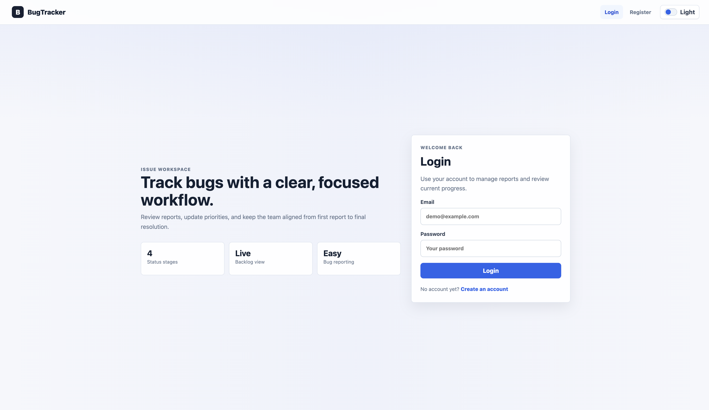

<div align="center">


<br />


<br />
<br />

<p>
  <b>A public case study for a private full-stack bug tracking application.</b>
</p>

<p>
  Built to manage software bug reports with authentication, protected routes, filtering, status updates, priority updates, responsive UI, and light/dark mode.
</p>

<p>
  <a href="https://bug-tracker-fullstack-app.vercel.app"><b>Open Live Demo</b></a>
  ·
  <a href="./docs/case-study.md"><b>Read Case Study</b></a>
  ·
  <a href="./docs/architecture.md"><b>Architecture</b></a>
  ·
  <a href="./docs/testing.md"><b>Testing</b></a>
</p>

</div>

<hr />

<h2 align="center">Project Preview</h2>

<div align="center">


</div>

<hr />

<h2 align="center">About This Project</h2>

<p align="center">
  <b>Bug Tracker Fullstack App</b> is a full-stack web application for reporting, tracking, filtering, and updating software bugs.
</p>

<p align="center">
  The project includes user authentication, JWT-protected routes, bug CRUD workflows, PostgreSQL persistence, Prisma ORM, responsive layouts, and a light/dark theme toggle.
</p>

<p align="center">
  This repository is a <b>public showcase only</b>. The production source code is private.
</p>

<hr />

<h2 align="center">Application Flow</h2>

```txt
User
  ↓
React Frontend
  ↓
Axios API Client
  ↓
Express REST API
  ↓
JWT Auth Middleware
  ↓
Prisma ORM
  ↓
PostgreSQL Database
```

<hr />

<h2 align="center">Core Features</h2>

<table align="center">
  <tr>
    <th>Feature</th>
    <th>Description</th>
  </tr>
  <tr>
    <td><b>Authentication</b></td>
    <td>User registration, login, logout, JWT token handling, and protected routes.</td>
  </tr>
  <tr>
    <td><b>Bug Reporting</b></td>
    <td>Users can create bug reports with title, description, and priority.</td>
  </tr>
  <tr>
    <td><b>Bug List</b></td>
    <td>Displays bug reports in a clean card-based layout.</td>
  </tr>
  <tr>
    <td><b>Filtering</b></td>
    <td>Supports filtering bugs by status and priority.</td>
  </tr>
  <tr>
    <td><b>Bug Detail</b></td>
    <td>Shows bug information, reporter data, timestamps, status, and priority.</td>
  </tr>
  <tr>
    <td><b>Status Updates</b></td>
    <td>Users can update bug status from the detail page.</td>
  </tr>
  <tr>
    <td><b>Priority Updates</b></td>
    <td>Users can update bug priority from the detail page.</td>
  </tr>
  <tr>
    <td><b>Delete Permission</b></td>
    <td>Only the bug reporter or an admin can delete a bug.</td>
  </tr>
  <tr>
    <td><b>Responsive UI</b></td>
    <td>The interface works across desktop, tablet, and mobile screens.</td>
  </tr>
  <tr>
    <td><b>Light/Dark Mode</b></td>
    <td>Theme toggle with saved browser preference.</td>
  </tr>
</table>

<hr />

<h2 align="center">Built With</h2>

<div align="center">

<table>
  <tr>
    <td align="center"><b>React</b></td>
    <td align="center"><b>Vite</b></td>
    <td align="center"><b>React Router</b></td>
    <td align="center"><b>Axios</b></td>
    <td align="center"><b>Node.js</b></td>
  </tr>
  <tr>
    <td align="center"><b>Express</b></td>
    <td align="center"><b>PostgreSQL</b></td>
    <td align="center"><b>Prisma</b></td>
    <td align="center"><b>JWT</b></td>
    <td align="center"><b>bcryptjs</b></td>
  </tr>
  <tr>
    <td align="center"><b>Vercel</b></td>
    <td align="center"><b>Render</b></td>
    <td align="center"><b>Neon</b></td>
    <td align="center"><b>Postman</b></td>
    <td align="center"><b>Manual Testing</b></td>
  </tr>
</table>

</div>

<hr />

<h2 align="center">Screenshots</h2>

<h3 align="center">Login - Light Mode</h3>

<div align="center">
  
</div>

<br />

<h3 align="center">Login - Dark Mode</h3>

<div align="center">
  
</div>

<br />

<h3 align="center">Dashboard</h3>

<div align="center">
  
</div>

<br />

<h3 align="center">Bug List</h3>

<div align="center">
  
</div>

<br />

<h3 align="center">Bug Detail</h3>

<div align="center">
  
</div>

<br />

<h3 align="center">Mobile Responsive</h3>

<div align="center">
  
</div>

<hr />

<h2 align="center">System Architecture</h2>

<table align="center">
  <tr>
    <th>Layer</th>
    <th>Responsibility</th>
  </tr>
  <tr>
    <td><b>React Frontend</b></td>
    <td>UI, routing, authentication state, protected pages, forms, and API requests.</td>
  </tr>
  <tr>
    <td><b>Axios Client</b></td>
    <td>Handles API calls and attaches JWT tokens to protected requests.</td>
  </tr>
  <tr>
    <td><b>Express Backend</b></td>
    <td>Provides REST API endpoints for authentication and bug management.</td>
  </tr>
  <tr>
    <td><b>JWT Middleware</b></td>
    <td>Protects private API routes and loads the authenticated user.</td>
  </tr>
  <tr>
    <td><b>Prisma ORM</b></td>
    <td>Handles database models, relationships, and PostgreSQL queries.</td>
  </tr>
  <tr>
    <td><b>PostgreSQL</b></td>
    <td>Stores users, bug reports, statuses, priorities, and relationships.</td>
  </tr>
</table>

<hr />

<h2 align="center">Project Structure</h2>

```txt
bug-tracker-case-study/
│
├── README.md
│
├── screenshots/
│   ├── login-light.png
│   ├── login-dark.png
│   ├── dashboard.png
│   ├── bug-list.png
│   ├── bug-detail.png
│   └── mobile.png
│
└── docs/
    ├── architecture.md
    ├── case-study.md
    ├── deployment.md
    ├── features.md
    └── testing.md
```

<hr />

<h2 align="center">What I Built</h2>

<table align="center">
  <tr>
    <th>Area</th>
    <th>Work Completed</th>
  </tr>
  <tr>
    <td><b>Frontend</b></td>
    <td>Designed responsive pages, protected routes, forms, bug cards, detail views, and light/dark mode.</td>
  </tr>
  <tr>
    <td><b>Backend</b></td>
    <td>Built Express API endpoints for authentication and bug management.</td>
  </tr>
  <tr>
    <td><b>Authentication</b></td>
    <td>Implemented JWT login, register, current user lookup, and protected API middleware.</td>
  </tr>
  <tr>
    <td><b>Database</b></td>
    <td>Designed User and Bug models with Prisma and PostgreSQL relationships.</td>
  </tr>
  <tr>
    <td><b>Deployment</b></td>
    <td>Deployed frontend, backend, and database with separate production services.</td>
  </tr>
  <tr>
    <td><b>Documentation</b></td>
    <td>Prepared API, database, deployment, testing, architecture, and case study documentation.</td>
  </tr>
</table>

<hr />

<h2 align="center">Testing Summary</h2>

<table align="center">
  <tr>
    <th>Test Area</th>
    <th>Covered Cases</th>
  </tr>
  <tr>
    <td><b>Authentication</b></td>
    <td>Register, login, logout, protected route redirect, current user lookup.</td>
  </tr>
  <tr>
    <td><b>Bug Management</b></td>
    <td>Create, list, filter, detail, update status, update priority, delete.</td>
  </tr>
  <tr>
    <td><b>API</b></td>
    <td>Postman testing for auth endpoints and protected bug endpoints.</td>
  </tr>
  <tr>
    <td><b>Responsive UI</b></td>
    <td>Desktop, tablet, mobile navigation, no horizontal overflow checks.</td>
  </tr>
  <tr>
    <td><b>Theme</b></td>
    <td>Light mode, dark mode, and saved theme preference.</td>
  </tr>
</table>

<hr />

<h2 align="center">Deployment</h2>

```txt
Vercel Frontend
  ↓
Render Backend API
  ↓
Neon PostgreSQL
```

<table align="center">
  <tr>
    <th>Service</th>
    <th>Platform</th>
  </tr>
  <tr>
    <td><b>Frontend</b></td>
    <td>Vercel</td>
  </tr>
  <tr>
    <td><b>Backend API</b></td>
    <td>Render</td>
  </tr>
  <tr>
    <td><b>Database</b></td>
    <td>Neon PostgreSQL</td>
  </tr>
</table>

<hr />

<h2 align="center">Documentation</h2>

<table align="center">
  <tr>
    <th>Document</th>
    <th>Description</th>
  </tr>
  <tr>
    <td><a href="./docs/case-study.md"><b>Case Study</b></a></td>
    <td>Problem, goal, role, solution, challenges, and results.</td>
  </tr>
  <tr>
    <td><a href="./docs/architecture.md"><b>Architecture</b></a></td>
    <td>System overview, frontend, backend, database, and deployment flow.</td>
  </tr>
  <tr>
    <td><a href="./docs/features.md"><b>Features</b></a></td>
    <td>Authentication, bug management, UI, and documentation features.</td>
  </tr>
  <tr>
    <td><a href="./docs/testing.md"><b>Testing</b></a></td>
    <td>Manual testing areas, API testing, and regression checklist.</td>
  </tr>
  <tr>
    <td><a href="./docs/deployment.md"><b>Deployment</b></a></td>
    <td>Frontend, backend, database, and production environment notes.</td>
  </tr>
</table>

<hr />

<h2 align="center">Source Code Notice</h2>

<div align="center">

<p>
  The source code for this project is private.
</p>

<p>
  This repository is a public case study and project showcase for portfolio review.
</p>

<p>
  No environment variables, database credentials, JWT secrets, or private implementation files are included here.
</p>

</div>

<hr />

<div align="center">

<p>
  <b>Built as a full-stack portfolio project by Rittiporn Phungphai.</b>
</p>

<p>
  <a href="https://bug-tracker-fullstack-app.vercel.app">Live Demo</a>
  ·
  <a href="./docs/case-study.md">Case Study</a>
  ·
  <a href="./docs/testing.md">Testing Notes</a>
</p>

</div>
