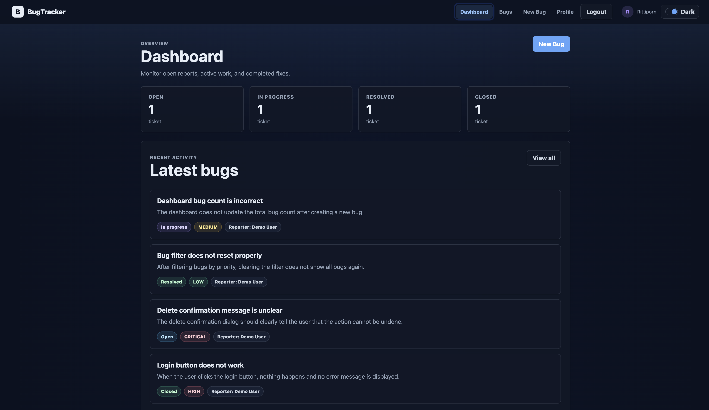
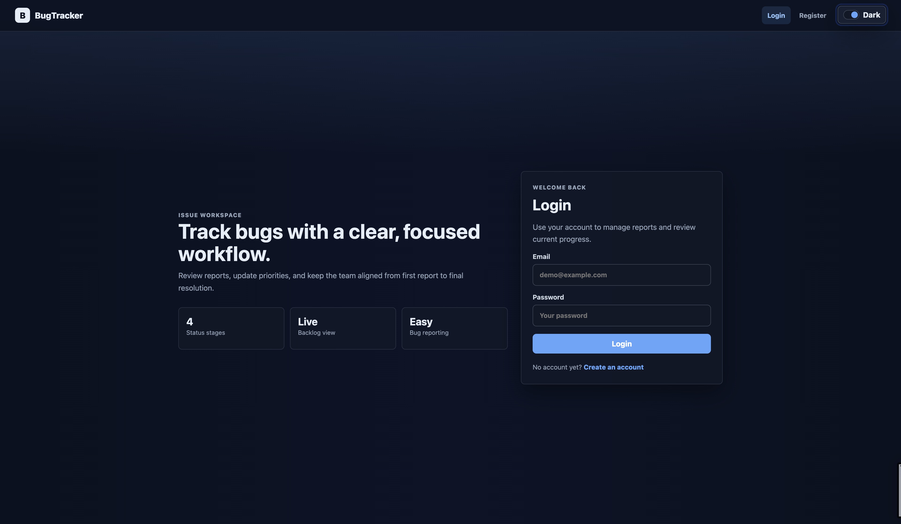
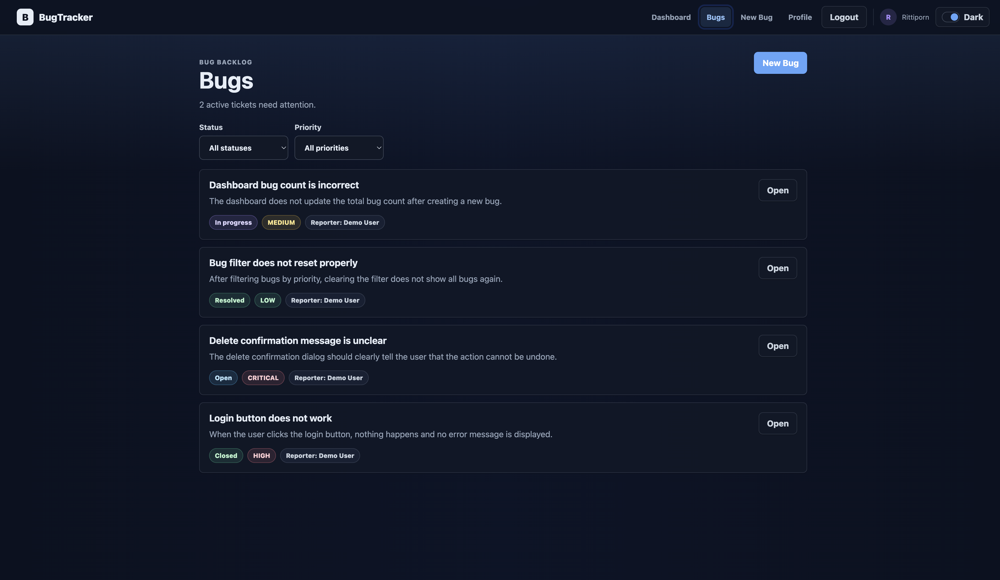
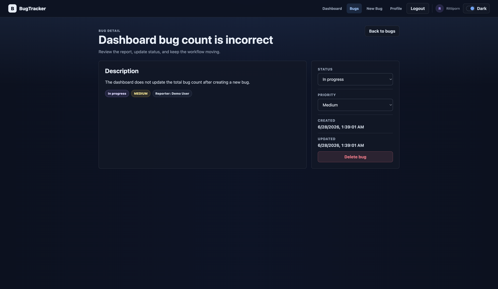
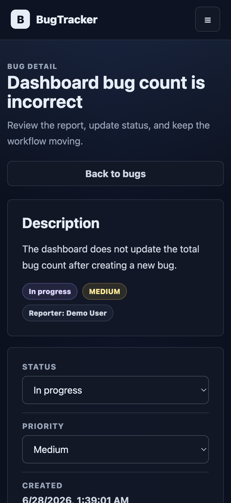

<div align="center">


<br />


<br />
<br />

<p>
  <b>A public case study for a private full-stack bug tracking application.</b>
</p>

<p>
  Built to manage software bug reports with authentication, protected routes, filtering, status updates, priority updates, responsive UI, and light/dark mode.
</p>

<p>
  <a href="https://bug-tracker-fullstack-app.vercel.app"><b>Live Demo</b></a>
  &nbsp;|&nbsp;
  <a href="./docs/case-study.md"><b>Case Study</b></a>
  &nbsp;|&nbsp;
  <a href="./docs/architecture.md"><b>Architecture</b></a>
  &nbsp;|&nbsp;
  <a href="./docs/testing.md"><b>Testing</b></a>
</p>

</div>

<hr />

<h2 align="center">Overview</h2>

<p align="center">
  <b>Bug Tracker Fullstack App</b> is a portfolio project designed to demonstrate practical full-stack development, authentication, database integration, deployment, responsive UI, and testing documentation.
</p>

<p align="center">
  This repository contains only public showcase material, screenshots, and documentation. The production source code remains private.
</p>

<div align="center">

<table>
  <tr>
    <th>Live Demo</th>
    <td>
      <a href="https://bug-tracker-fullstack-app.vercel.app">
        https://bug-tracker-fullstack-app.vercel.app
      </a>
    </td>
  </tr>
  <tr>
    <th>Project Type</th>
    <td>Private source project with public case study repository</td>
  </tr>
</table>

</div>

<hr />

<h2 align="center">Preview</h2>

<div align="center">



</div>

<hr />

<h2 align="center">Key Features</h2>

<table align="center">
  <tr>
    <th>Feature</th>
    <th>Description</th>
  </tr>
  <tr>
    <td><b>Authentication</b></td>
    <td>Registration, login, logout, JWT token handling, and protected routes.</td>
  </tr>
  <tr>
    <td><b>Bug Management</b></td>
    <td>Create, view, filter, update, and delete bug reports.</td>
  </tr>
  <tr>
    <td><b>Filtering</b></td>
    <td>Filter bug reports by status and priority.</td>
  </tr>
  <tr>
    <td><b>Dashboard</b></td>
    <td>Summary cards and recent bug overview.</td>
  </tr>
  <tr>
    <td><b>Permissions</b></td>
    <td>Delete behavior is protected by reporter/admin permission checks.</td>
  </tr>
  <tr>
    <td><b>Responsive UI</b></td>
    <td>Supports desktop, tablet, and mobile layouts.</td>
  </tr>
  <tr>
    <td><b>Light / Dark Theme</b></td>
    <td>Theme toggle with saved browser preference.</td>
  </tr>
</table>

<hr />

<h2 align="center">Built With</h2>

<div align="center">

<table>
  <tr>
    <td align="center">React</td>
    <td align="center">Vite</td>
    <td align="center">React Router</td>
    <td align="center">Axios</td>
    <td align="center">Plain CSS</td>
  </tr>
  <tr>
    <td align="center">Node.js</td>
    <td align="center">Express</td>
    <td align="center">JWT</td>
    <td align="center">bcryptjs</td>
    <td align="center">Prisma</td>
  </tr>
  <tr>
    <td align="center">PostgreSQL</td>
    <td align="center">Neon</td>
    <td align="center">Render</td>
    <td align="center">Vercel</td>
    <td align="center">Postman</td>
  </tr>
</table>

</div>

<hr />

<h2 align="center">Application Flow</h2>

```txt
User
  ↓
Register / Login
  ↓
JWT Authentication
  ↓
Protected Frontend Routes
  ↓
Dashboard / Bug List
  ↓
Create, View, Filter, Update, or Delete Bug Reports
  ↓
Express API
  ↓
Prisma ORM
  ↓
PostgreSQL Database
```

<hr />

<h2 align="center">Screenshots</h2>

<h3 align="center">Login - Light Mode</h3>

<div align="center">
  
</div>

<br />

<h3 align="center">Login - Dark Mode</h3>

<div align="center">
  
</div>

<br />

<h3 align="center">Bug List</h3>

<div align="center">
  
</div>

<br />

<h3 align="center">Bug Detail</h3>

<div align="center">
  
</div>

<br />

<h3 align="center">Mobile Responsive</h3>

<div align="center">
  
</div>

<hr />

<h2 align="center">Documentation</h2>

<table align="center">
  <tr>
    <th>Document</th>
    <th>Description</th>
  </tr>
  <tr>
    <td><a href="./docs/case-study.md"><code>case-study.md</code></a></td>
    <td>Problem, goal, role, solution, challenges, and result.</td>
  </tr>
  <tr>
    <td><a href="./docs/architecture.md"><code>architecture.md</code></a></td>
    <td>Frontend, backend, database, deployment, and request flow.</td>
  </tr>
  <tr>
    <td><a href="./docs/features.md"><code>features.md</code></a></td>
    <td>Feature summary grouped by product area.</td>
  </tr>
  <tr>
    <td><a href="./docs/testing.md"><code>testing.md</code></a></td>
    <td>Manual testing areas, API testing notes, and regression checklist.</td>
  </tr>
  <tr>
    <td><a href="./docs/deployment.md"><code>deployment.md</code></a></td>
    <td>Deployment architecture, platforms, and production notes.</td>
  </tr>
</table>

<hr />

<h2 align="center">Repository Structure</h2>

```txt
bug-tracker-case-study/
│
├── README.md
│
├── screenshots/
│   ├── login-light.png
│   ├── login-dark.png
│   ├── dashboard.png
│   ├── bug-list.png
│   ├── bug-detail.png
│   └── mobile.png
│
└── docs/
    ├── architecture.md
    ├── case-study.md
    ├── deployment.md
    ├── features.md
    └── testing.md
```

<hr />

<h2 align="center">Source Code Notice</h2>

<div align="center">

<p>
  The source code, environment variables, database credentials, JWT secrets, and private implementation files are not included in this repository.
</p>

<p>
  This repository is a public case study and project showcase for portfolio review only.
</p>

</div>

<hr />

<h2 align="center">Author</h2>

<div align="center">

<p>
  <b>Rittiporn Phungphai</b>
</p>

<p>
  Software Development | Full-Stack Development | Software Quality | API Testing
</p>

<p>
  <a href="https://github.com/Rittiporn12">GitHub Profile</a>
  &nbsp;|&nbsp;
  <a href="https://rittiporn12.github.io/portfolio/">Portfolio Website</a>
</p>

</div>

<hr />

<div align="center">

<p>
  <b>Thank you for reviewing this project.</b>
</p>

</div>


